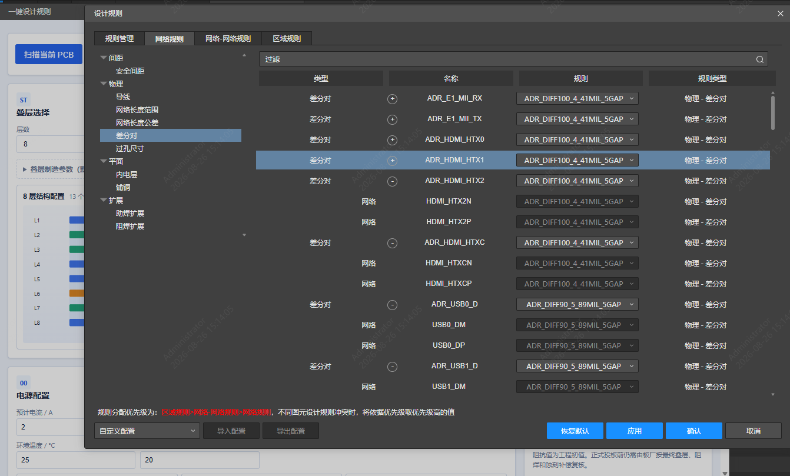
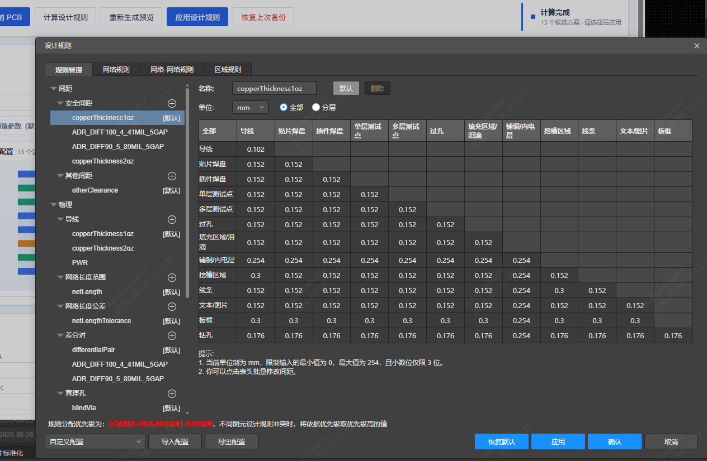

# 设计规则生成器

自动按网络命名识别差分、阻抗、电源与地网络，结合离线阻抗计算引擎生成分层线宽和间距，一键分配 PCB 设计规则到嘉立创EDA。

**本地阻抗计算是基于[嘉立创阻抗计算神器](https://tools.jlc.com/jlcTools/index.html#/impedanceCalculatenew)构建的离线计算RBF模型，可能存在误差，不建议直接应用于生成环境，建议核对在线计算器后使用**

## 功能

- **网络自动分类** — 按命名规则或通过AI扫描全部网络，识别差分对、电源、地、阻抗单端和普通信号

- **离线阻抗计算** — 内置嘉立创 12 种阻抗模式，RBF 代理模型求解，无需联网。支持线宽反算

- **叠层数据库** — 内置嘉立创全部叠层模板，按层数/板厚/铜厚自动匹配推荐叠构，可视化预览

- **网络类自动创建** — 动态为每个阻抗分组创建网络类，类行绑定 ，成员共享规则。

- **差分对规则绑定** — 自动创建差分对对象，并写入绑定

- **备份与恢复** — 应用前自动备份当前规则配置，支持一键恢复

## 使用

1. 打开 PCB 文件
2. 菜单 → Auto Design Rules → Assign Design Rules...
3. 选择叠层（层数、板厚、铜厚会自动关联）
4. 点击「扫描当前 PCB」— 自动分类全部网络
5. 在阻抗输入区填写目标阻抗（如差分 100Ω、USB 90Ω），选择阻抗层和参考层
6. 点击「计算设计规则」— 离线引擎求解线宽/间距，生成 profile 预览
7. 确认预览无误后点击「应用设计规则」— 先备份、再写入、后验证
8. 如需回退，点击「恢复上次备份」

## 相关计算器
[嘉立创阻抗计算神器](https://tools.jlc.com/jlcTools/index.html#/impedanceCalculatenew)  
[嘉立创线路耐电流计算器](https://www.jlc-fpc.com/trace-current-calculator)  
[嘉立创过孔电流计算](https://www.jlc-fpc.com/via-current-calculator)