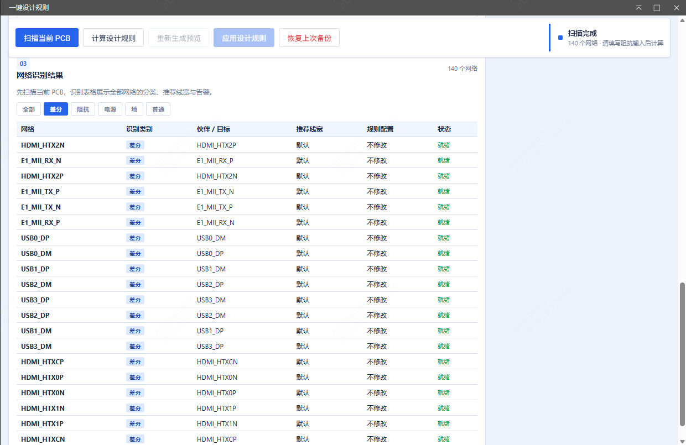
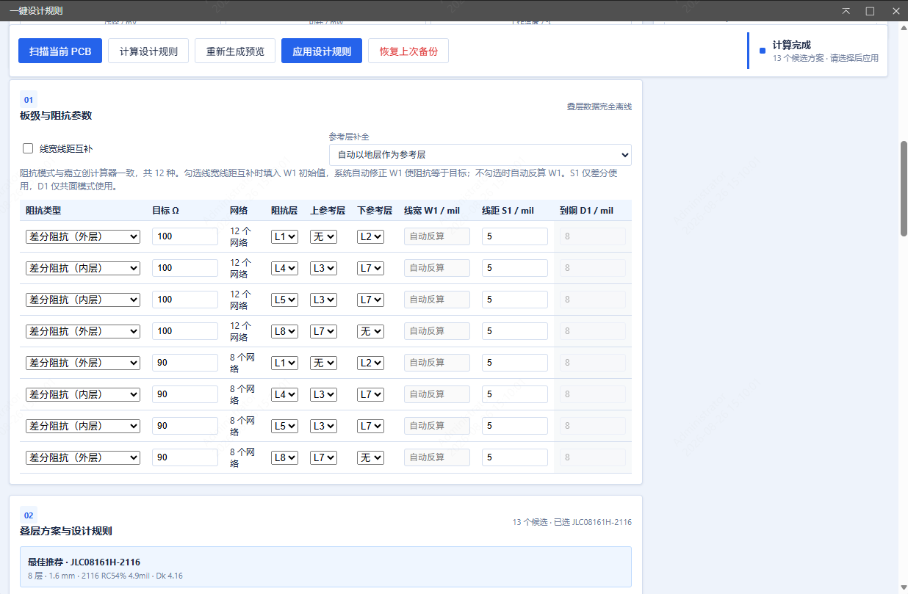
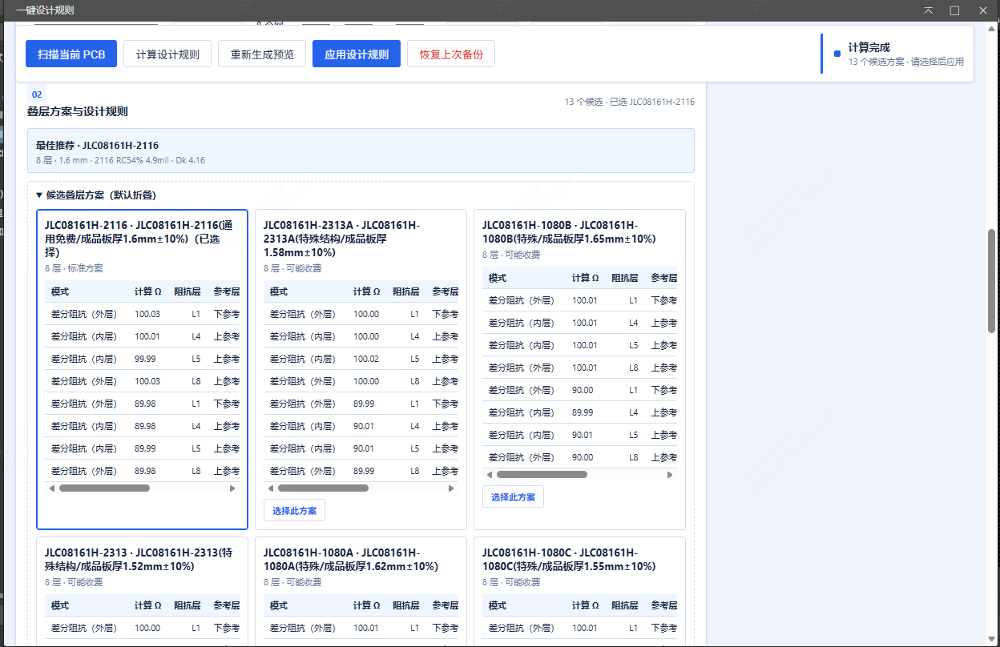
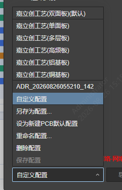

# 设计规则生成器

自动按网络命名识别差分、阻抗、电源与地网络，结合离线阻抗计算引擎生成分层线宽和间距，并另存为新的嘉立创EDA设计规则配置。

**阻抗计算为离线版本，以[嘉立创阻抗计算器](https://jlcpcb.com/hk/pcb-impedance-calculator)采样校准的 RBF 模型完成计算。仅供估算与预览，不建议应用于生产。**

## 功能

- **网络自动分类** — 按命名规则或通过AI扫描全部网络，识别差分对、电源、地、阻抗单端和普通信号  

- **离线阻抗计算** — 内置嘉立创 12 种阻抗模式，RBF 代理模型求解，无需联网。支持线宽反算  

- **叠层数据库** — 内置嘉立创全部叠层模板，按层数/板厚/铜厚自动匹配推荐叠构，可视化预览  

- **规则配置预览** — 按网络分组显示建议的线宽、间距和配置名称，但不改写当前 PCB 的网络类或差分对

- **安全生成** — 按“工程名称-板子名称”另存设计规则配置，不激活，也不改写当前 PCB 的网络规则、差分对、网络类或网络颜色

## 使用

1. 打开 PCB 文件
2. 菜单 → 设计规则生成器 → 打开...
3. 选择叠层（层数、板厚、铜厚会自动关联）
4. 点击「扫描当前 PCB」— 自动分类全部网络
5. 在阻抗输入区填写目标阻抗（如差分 100Ω、USB 90Ω），选择阻抗层和参考层
6. 点击「计算设计规则」— 离线引擎求解线宽/间距，生成 profile 预览
7. 确认预览无误后点击「生成设计规则」；配置按“工程名称-板子名称”保存，当前使用的设计规则保持不变
8. 如需使用生成结果，请在 EasyEDA 设计规则管理器中手动选择该配置

## 相关计算器
- [嘉立创阻抗计算神器](https://tools.jlc.com/jlcTools/index.html#/impedanceCalculatenew)
- [嘉立创线路耐电流计算器](https://www.jlc-fpc.com/trace-current-calculator)
- [嘉立创过孔电流计算](https://www.jlc-fpc.com/via-current-calculator)
